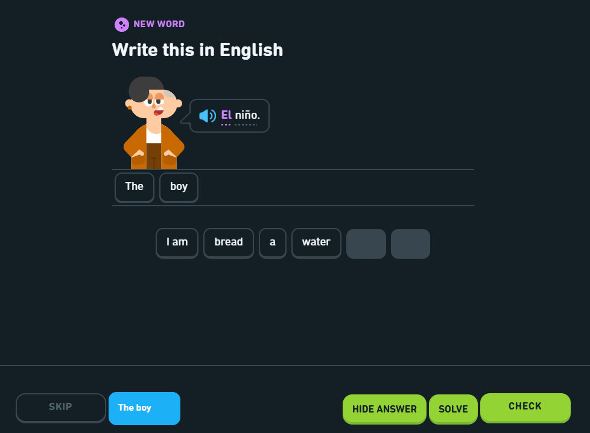

#  Welcome to Berlingo documentation

Berlingo is a chrome extension that allows you to solve Duolingo lessons.

## Requirements

- A chrome-based browser (e.g. Google Chrome, Microsoft Edge, Brave, Opera GX, etc.)

## Installation

Since the extension is still in beta (pre version 1.0), the extension is currently not available in the chrome web
store.
But, you can still use it by installing it manually, here are the steps :

- Download the latest version of the `berlingo.1.2.3.zip` on
  the [release page](https://github.com/berlingo/berlingo/releases/latest) (where ``1.2.3` is the version number)
- Go to your browser
- Go to `Settings`
- Go to `Extensions`
- Go to `Manage extensions`
- Enable `Developer mode`
- Drag-n-drop the `berlingo.1.2.3.zip` file in the browser window
- The `Berlingo` extension should now appeared in the list of installed extensions and the extension's icon should now
  be visible in the browser taskbar

For further details for a specific browser, see the [installation page](./installation.md)

You now ready to start using Berlingo, please see the [get started page](./get-started.md) for further details.
