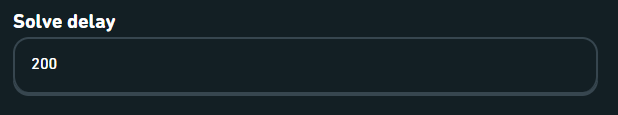

#### Extension panel

You can click on the extension icon in your browser taskbar to open the extension panel.

You'll find the extension version, the current language detected on the duolingo website and a few useful links:

- Report a bug. Let us know if something went wrong
- Documentation. Brings you to the documentation you're reading now
- Open the project page. Brings you to the project's github page
- Download the log file. If something goes wrong, this file will probably help the developers to fix the issue

#### Solving a duolingo lesson

When you're in a Duolingo lesson, new actions will be available to:

- Solve the lesson for you
- Show you the correct answer

#### Settings

If you access the settings page on the Duolingo website, new settings will be available to:

- Adjust the solving speed (solve delay)

